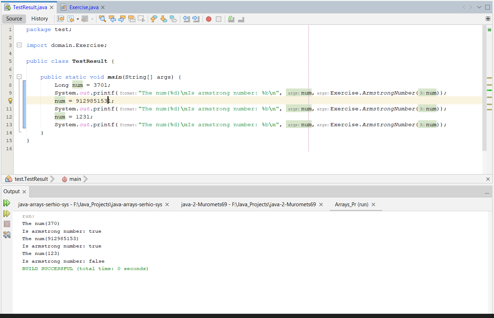

[](https://classroom.github.com/open-in-codespaces?assignment_repo_id=10114415)
# Завдання 13

Перевірте чи є задане число числом Армстронга

# Скріншот програми



# Код класу Exercise
```java
package domain;

import java.util.Objects;

public class Exercise {
    public static boolean ArmstrongNumber(Long R){
        String num = Long.toString(R);
        Integer lenght = num.length();
        Double sum = 0d;
        for(int i = 0;i<lenght;i++){
            sum += Math.pow(Long.parseLong(Character.toString(num.charAt(i))), lenght);
        }
        return Objects.equals(Double.valueOf(R), sum);
    }
}

```
